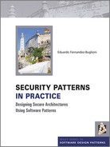

# 目录

- [第 1 章 动力和目标](./ch1.md)
- [第 2 章 模式和安全模式](./ch2.md)
- [第 3 章 安全的系统开发方法](./ch3.md)
- [第 4 章 身份管理模式](./ch4.md)
- [第 5 章 身份验证模式](./ch5.md)
- [第 6 章 访问控制模式](./ch6.md)
- [第 7 章 用于安全流程管理的模式](./ch7.md)
- [第 8 章 用于安全执行和文件管理的](./ch8.md)
- [第 9 章 安全操作系统体系结构和管](./ch9.md)
- [第 10 章 网络安全模式](./ch10.md)
- [第 11 章 Web 服务安全模式](./ch11.md)
- [第 12 章 Web 服务加密的模式](./c12.md)
- [第 13 章 安全中间件的模式](./ch13.md)
- [第 14 章 滥用模式](./ch14.md)
- [第 15 章 云计算架构的模式](./ch15.md)
- [第 16 章 构建安全体系结构](./ch16.md)
- [第 17 章 总结和未来的安全模式](./ch17.md)
